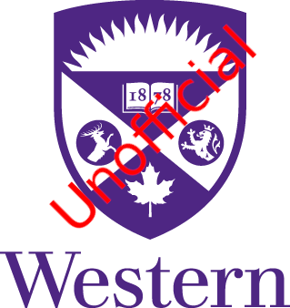

<!--
*** Thanks for checking out this README Template. If you have a suggestion that would
*** make this better, please fork the uwo-tt-api and create a pull request or simply open
*** an issue with the tag "enhancement".
*** Thanks again! Now go create something AMAZING! :D
***
***
***
*** To avoid retyping too much info. Do a search and replace for the following:
*** cbaron3, uwo-tt-api, twitter_handle, email
-->


<!-- PROJECT SHIELDS -->
<!--
*** I'm using markdown "reference style" links for readability.
*** Reference links are enclosed in brackets [ ] instead of parentheses ( ).
*** See the bottom of this document for the declaration of the reference variables
*** for contributors-url, forks-url, etc. This is an optional, concise syntax you may use.
*** https://www.markdownguide.org/basic-syntax/#reference-style-links
-->
[![Contributors][contributors-shield]][contributors-url]
[![Forks][forks-shield]][forks-url]
[![Stargazers][stars-shield]][stars-url]
[![Issues][issues-shield]][issues-url]
[![MIT License][license-shield]][license-url]
[![LinkedIn][linkedin-shield]][linkedin-url]

<!-- PROJECT LOGO -->
<br />
<p align="center">
  <a href="https://github.com/cbaron3/uwo-tt-api">
    
  </a>

  <h3 align="center">UNOFFICIAL UWO Timetable API</h3>
  <p align="center">
    Simple API to access data from the <a href="https://studentservices.uwo.ca/secure/timetables/mastertt/ttindex.cfm"><strong>Western Undergraduate Timetable. </strong></a>
    <br />
    The goal of this API is to give programmers a data interface to create software that that leverage UWO timetable information. For example, a custom timetable generator.
    <br />
    <br />
    <a href="http://uwottapi.ca">View Demo</a>
    ·
    <a href="https://github.com/cbaron3/uwo-tt-api/issues">Report Bug</a>
    ·
    <a href="https://github.com/cbaron3/uwo-tt-api/issues">Request Feature</a>
  </p>
</p>


<!-- TABLE OF CONTENTS -->
## Table of Contents

* [About the Project](#about-the-project)
  * [Built With](#built-with)
* [Getting Started](#getting-started)
  * [Prerequisites](#prerequisites)
  * [Installation](#installation)
* [Usage](#usage)
* [Roadmap](#roadmap)
* [Contributing](#contributing)
* [License](#license)
* [Contact](#contact)
* [Acknowledgements](#acknowledgements)


<!-- ABOUT THE PROJECT -->
## About The Project

[![Product Name Screen Shot][product-screenshot]](http://uwottapi.ca)

Currently, there exists no official timetable API and no unofficial options. To gather data from <a href="https://studentservices.uwo.ca/secure/timetables/mastertt/ttindex.cfm"><strong>Western Undergraduate Timetable, </strong></a>
each programmer must scrape the website themselves. This is not only tedious but challenging cause the website will start blocking requests if a single IP is overloading it. In my experiements, if a series of requests are made with less than a 10 second buffer between each, they will start getting blocked.

To overcome this issue, this API is designed with a built-in scraper. Every day, the scraper populates a database while waiting in between each request to ensure none is blocked. The API then provides a simple interface to query data from the database.

This API supports the following:
* Pagination
* Sorting
* Filtering
* Rate Limiting

The API has two main types of endpoint:

1. Options - Data from form options. 
2. Courses - Data from form results

### Built With

* [golang 1.14](https://golang.org/)
* [gin](https://github.com/gin-gonic/gin)
* [MongoDB](https://www.mongodb.com/)

<!-- GETTING STARTED -->
## Getting Started

To get a local copy up and running follow these simple steps.

### Prerequisites

By using [Docker](https://www.docker.com/), local development can start very easily. The only requirements are:

* docker
* docker-compose

### Installation - Docker Compose
 
1. Clone the repository
```sh
git clone https://github.com/cbaron3/uwo-tt-api.git
```
2. Compose the docker images
```sh
docker-compose up --build
```

docker-compose spins up two images: an image for the API on port 8080 and a MongoDB image


<!-- USAGE EXAMPLES -->
## Usage

For full API documentation, refer to [Documentation](http://uwottapi.ca/doc/index.html)

For usage examples, refer to [Examples](assets/EXAMPLES.md)

Usage is currently limited to <strong>120 requests per hour</strong> due to server limitations. This limit can be modified if the project warrants purchasing strong a better server.

<!-- ROADMAP -->
## Roadmap

See the [open issues](https://github.com/cbaron3/uwo-tt-api/issues) for a list of proposed features (and known issues).

<!-- CONTRIBUTING -->
## Contributing

Contributions are what make the open source community such an amazing place to be learn, inspire, and create. Any contributions you make are **greatly appreciated**.

1. Fork the Project
2. Create your Feature Branch (`git checkout -b feature/AmazingFeature`)
3. Commit your Changes (`git commit -m 'Add some AmazingFeature'`)
4. Push to the Branch (`git push origin feature/AmazingFeature`)
5. Open a Pull Request


<!-- LICENSE -->
## License

Distributed under the GNU License. See `LICENSE` for more information.

<!-- MARKDOWN LINKS & IMAGES -->
<!-- https://www.markdownguide.org/basic-syntax/#reference-style-links -->
[contributors-shield]: https://img.shields.io/github/contributors/cbaron3/uwo-tt-api.svg?style=flat-square
[contributors-url]: https://github.com/cbaron3/uwo-tt-api/graphs/contributors
[forks-shield]: https://img.shields.io/github/forks/cbaron3/uwo-tt-api.svg?style=flat-square
[forks-url]: https://github.com/cbaron3/uwo-tt-api/network/members
[stars-shield]: https://img.shields.io/github/stars/cbaron3/uwo-tt-api.svg?style=flat-square
[stars-url]: https://github.com/cbaron3/uwo-tt-api/stargazers
[issues-shield]: https://img.shields.io/github/issues/cbaron3/uwo-tt-api.svg?style=flat-square
[issues-url]: https://github.com/cbaron3/uwo-tt-api/issues
[license-shield]: https://img.shields.io/github/license/cbaron3/uwo-tt-api.svg?style=flat-square
[license-url]: https://github.com/cbaron3/uwo-tt-api/blob/master/LICENSE.txt
[linkedin-shield]: https://img.shields.io/badge/-LinkedIn-black.svg?style=flat-square&logo=linkedin&colorB=555
[linkedin-url]: https://www.linkedin.com/in/carl-baron3/
[product-screenshot]: assets/example.png